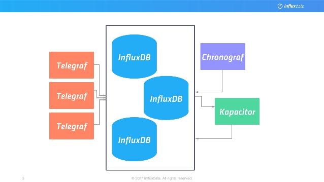

### Anomaly detection

Python programs to understand and detect outliers. Kapacitor TICKscript (ie, part of influxdata company) to detect anomaly after processing stream of metrics coming from Influxdb.

#### Kapacitor

How Kapacitor fits in metrics processing.

-------------

#### Guidelines to setup
- Kapacitor (README)
- py-stats (README)

#### Footnotes :

- http://dieter.plaetinck.be/post/practical-fault-detection-alerting-dont-need-to-be-data-scientist/
- https://www.scalyr.com/community/guides/how-to-set-alerts
- https://speakerdeck.com/astanway/a-deep-dive-into-monitoring-with-skyline
