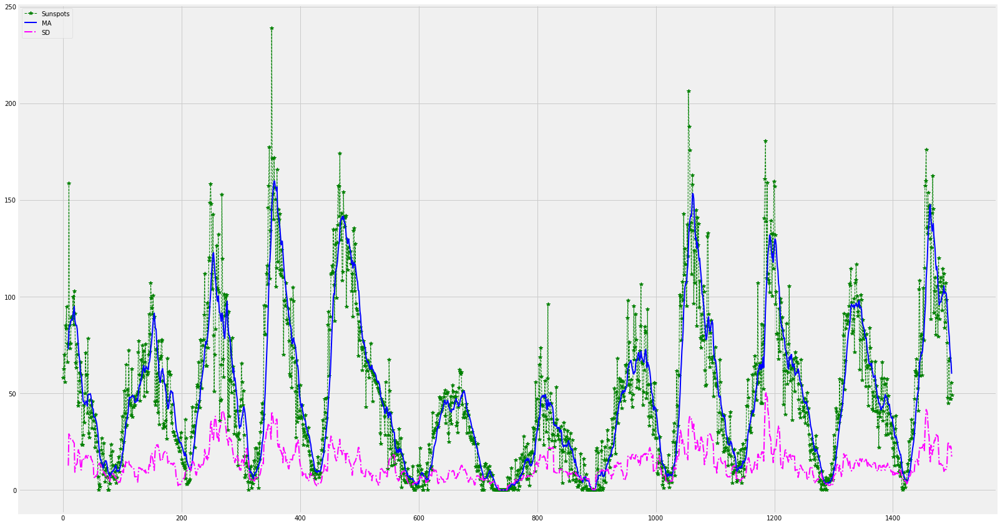
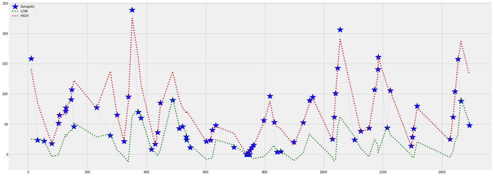

### Repo contains ipy-notebook written in Python 3.x
------------------------------------------

##### matplotlib
- https://matplotlib.org/faq/installing_faq.html#linux-notes


##### Pandas
Packages are available for all supported python versions on Windows, Linux, and MacOS.

Wheels are also uploaded to PyPI and can be installed with

```
$ pip install pandas
```
------------------

#### Helper guides
- https://blog.mafr.de/2012/03/11/time-series-data-with-matplotlib/
- https://chrisalbon.com/python/data_wrangling/pandas_create_column_using_conditional/
- https://stackoverflow.com/questions/17071871/select-rows-from-a-dataframe-based-on-values-in-a-column-in-pandas


- Use moving avg based python example https://www.datascience.com/blog/python-anomaly-detection
- Detect moving median based anomaly https://anomaly.io/anomaly-detection-moving-median-decomposition/#/import_csv
- Detect seasonal trend https://anomaly.io/seasonal-trend-decomposition-in-r/

> Wiki

- Moving_average https://en.wikipedia.org/wiki/Moving_average#Moving_median
- 3-Sigma Rule https://en.wikipedia.org/wiki/68%E2%80%9395%E2%80%9399.7_rule


##### Graphs
> Data points plot



> Anomaly detection trial


